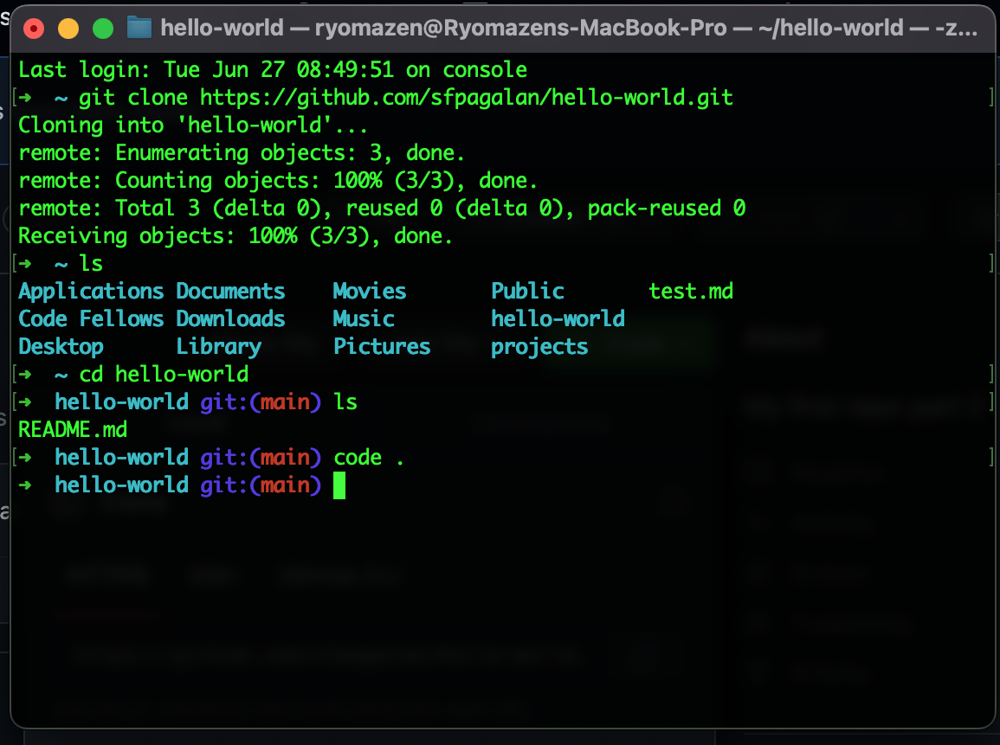

# Read 03: GIT Introduction

## Git

*[Source](https://blog.udemy.com/git-tutorial-a-comprehensive-guide/)*

- Git is a software that takes a snapshot of code at each time you save or **commit** a code.
- Git lets multiple developers work on the same code and Git keeps track of it and keeps a history of changes to the file.
- Git has the ability to view, apply, and remove those changes in the code.

### Version Control

- A system that allows you to revisit each versions of a file. With this, you can also revert to a file to the previous version.

### Commit

- Represents each succesive version of a file and folder.
*command: git commit -m 'insert message here'* on the terminal lets you add commit message.

## GitHub

- GitHub relates to Git.
- While Git is a software, GitHub is the website to share code.
- GitHub is an online place to store the code.

### Repositories *aka* Repos

- A collection of files that you tell Git to pay attention to.
- One project = One repository

### Cloning from GitHub to a computer

*Get the URL in GitHub by clicking the green button that says Code. Paste the URL in the terminal. Below is a screenshot of how to clone*

# Read 03: Answer the following.

1. What is Version Control?
    - A system that allows you to revisit each versions of a file. With this, you can also revert to a file to the previous version.
2. What is Cloning in Git?
    - Copying a repo from GitHub to the local computer.
3. What is the command to track and stage files?
    - git status
4. What is the command to take a snapshot of your changed files?
    - git commit
5. What is the command to send your changed files to GitHub?
    - git push origin main

[Home](https://sfpagalan.github.io/reading-notes/)