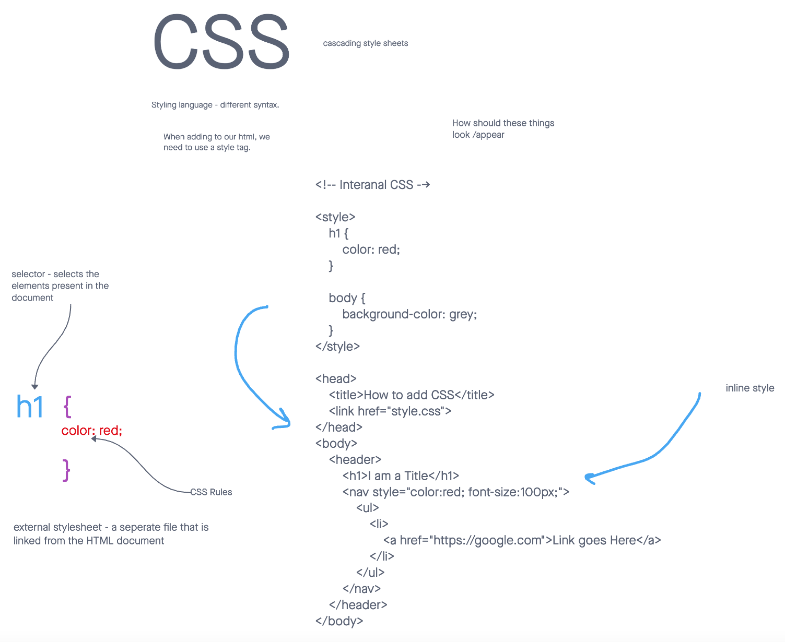

# Read 05: Cascading Style Sheets aka CSS

CSS is a styling language and has different syntax than the HTML.

### There are three ways to insert CSS:

- External CSS
- Internal CSS
- Inline CSS

**Selector** 

- selects the elements oresent in the document. ie: *img* for image or *h1* for header 1.

## Answer the following

1. What is the purpose of CSS?
    - Th purpose of CSS is to style and layout the website.
2. What are the three ways to insert CSS into your project?
    - External CSS
    - Internal CSS
    - Inline CSS
3. Write an example of CSS rule that would give all 
 elements red text.
    - p {
        color: red
    }

[Home](https://sfpagalan.github.io/reading-notes/)