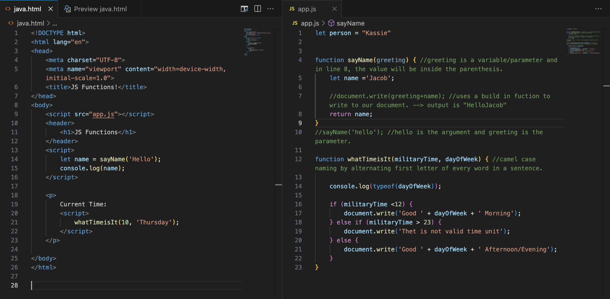

# Read 07: Programming with JavaScript

**Functions**
    A ways to make a code that we write re-useable.

*sample*

## Answer the following:

1. What is cotrol flow?

- Is the order in which the computer executes statements in a script.

2. What is JavaScript function?

- A JavaScript function is a block of code designed to perform a particular task.

3. What does it mean to invoke - or call - a function?

- When you invoke or call something, a JavaScript function is executed.

4. What are the parenthesis for when you define a function?

- Using a parenthesis to call a function you are invoking to execute the code.

