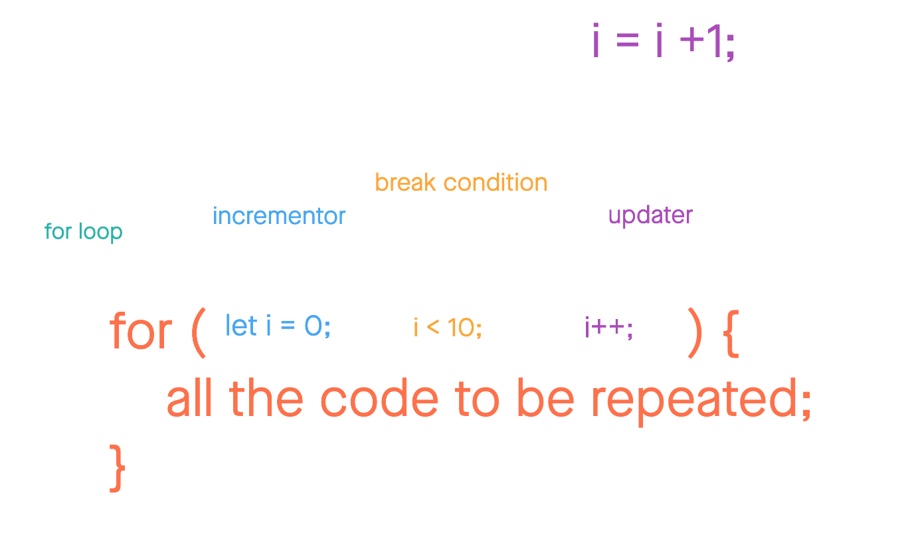
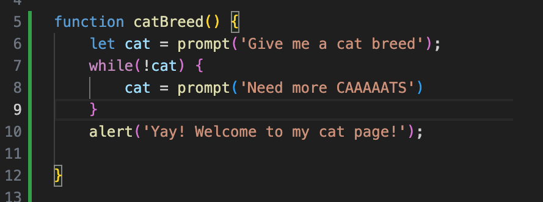

# Read 08: Operators and Loops

Looping Code
- any code that runs more than once.

### Of Loop

### While Loop

## Answer the following:

1. What is an expression in JavaScript?

- A valid set of literals, variables, operators, and expressions that evaluate a single value that is an expression.
- Can be a number, string, or logical value depending on the expression.

2. Why would we use a loop in our code?

- A computerized version of the an instruction.

3. When does a for loop stop executing?

- When a specific value becomes a false condition

4. How many times will a while loop execute?

- This repeats until a specific condition evaluates as false.

[Home](https://sfpagalan.github.io/reading-notes/)