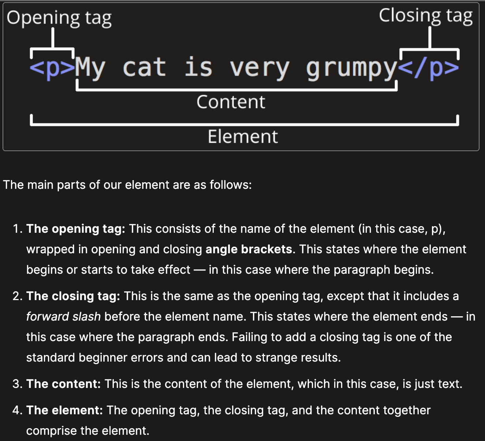

# Read: Class 01

## JavaScript Basics

[Source](https://developer.mozilla.org/en-US/docs/Learn/Getting_started_with_the_web/JavaScript_basics)

**JavaScript.**

- is a programming language that adds interactivity to the website.
- a powerful programming language that can add interactivity to a website.
- JavaScript was invented by Brendan Eich.
- versatile and beginner-friendly.

**1. Short poem describing how HTTP sends data between computers.**

-

**2. Describe how HTML, CSS, and JS files are "parsed" in the browser.**

- The browser builds the DOM tree and applies the styles from the CSSOM tree and executes the JavaScript, a visual representation of the page is painted to the screen and the user sees the page content and can begin to interact with it.

**3. How can you find images to add to a website.**

- by going to a public domain images. it is very unethical to hotlink an image from someone elses website.

**4. How do you create a String vs a Number in JavaScript?**

- You can create a string using a quotation symbols like ' or " and number with Number() to convert a value to a number.

**5. What is a Variable and why are they important in JavaScript?**

- Variables are used to hold a value or data like a storage.

## Intro to HTML

*Sources.*

- [Getting Started with HTML](https://developer.mozilla.org/en-US/docs/Learn/HTML/Introduction_to_HTML/Getting_started)
- [HTML Document Structure](https://developer.mozilla.org/en-US/docs/Learn/HTML/Introduction_to_HTML/Document_and_website_structure)
- [Metadata in HTML](https://developer.mozilla.org/en-US/docs/Learn/HTML/Introduction_to_HTML/The_head_metadata_in_HTML)

**1. What is an HTML attribute.**

- Provides additional information about elements.
- Usually come in name/value pairs like: name="value".

**2. Describe the Anatomy of an HTML element** [Source](https://developer.mozilla.org/en-US/docs/Learn/Getting_started_with_the_web/HTML_basics)

**3. What is the difference between < article > and < section > element tags?**

- Article tag specifies independent, self-contained content. While a Section tag defines sections in a document, such as chapters, headers, footers, or any sections of the document.

**4. What Elements does a "typical" website include?**

- navigation, header, footer.

**5. How does metadata influence Search Engine Optimization?**

- helps understand the content and context of the website.

**6. How is the < meta > HTML tag used when specifying metadata?**

- meta tag goes insdie the head element and used to specify character set, page description, keywords, author of the document, and viewport settings.

## How to start to design a Website [Source](https://developer.mozilla.org/en-US/docs/Learn/Common_questions/Design_and_accessibility/Thinking_before_coding)

**1. What is the first step to designing a Website?**

- what a person wants to accomplish or what the person wants the website to look like or its function.

**2. What is the most important question to answer when designing a Website?**

- "What exactly do I want to accomplish?".

## Semantics [Source](https://developer.mozilla.org/en-US/docs/Glossary/Semantics)

**1. Why should you use an < h1 > element over a < span > element to display a top level heading?**

- to make any element look like a heading.

**2. What are the benefits of using semantic tags in our HTML?**

- gives the text it wraps around the role or meaning of a top level heading on a page.

## What is JavaScript? [Source](https://developer.mozilla.org/en-US/docs/Learn/JavaScript/First_steps/What_is_JavaScript)

**1. Describe 2 things that require JavaScript in the browser?**

- adding interactivity to the web page and build web servers.

**2. How can you add JavaScript to an HTML document?**

- by applying < script > element. CSS can be added by applying < link > element for external stylesheets and < style > element for internal stylesheets.

## Things I want to know more about

- More ways to utilize elements and attributes. There some more attributes I saw some examples the I'm curious about and would like to use.
