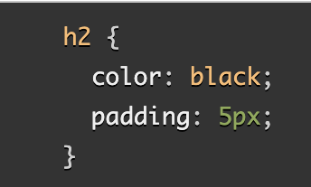

# Read: Class 02

## Introduction to HTML

[HMTL text fundamentals](https://developer.mozilla.org/en-US/docs/Learn/HTML/Introduction_to_HTML/HTML_text_fundamentals)
[Advance text formatting](https://developer.mozilla.org/en-US/docs/Learn/HTML/Introduction_to_HTML/Advanced_text_formatting)

**1. Why is it important to use semantic elements in out HTML?**

- Makes HTML more readable and makes the document comprehensive.

**2. How many levels of headings are there in HTML?**

- There are 6 heading elements: h1, h2, h3, h4, h5, and h6. 

**3. What are some uses for the < sup > and < sub > elements?**

- sup elements represents a superscript. sub elements represents a subscript.

**4. When using the < abbr > element, what attribute must be added to provide the full expansion of the term?**

- a title attribute to specify more information.

## Learn CSS
[How CSS Is Structured](https://developer.mozilla.org/en-US/docs/Learn/CSS/First_steps/How_CSS_is_structured)

**1. What are ways we can apply CSS to our HTML?**

- 3 ways to apply CSS to HTML:
    1. External stylesheets - a separate file with a .css extention.
    2. Internal stylesheets - is inside an HTML document.
    3. Inline styles - CSS declarations that affect a single HTML element contained within a *style* attribute.

**2. Why should we avoid using inline styles?**

- avoid using inline style when possible due to inefficient implementation of CSS.

**3. Review the block of code below and answer the following questions:**

1. What is representing the selector?

- h2

2. Which components are the CSS declarations?

- color: black; padding: 5px;

3. Which components are considered properties?**

- color and padding

## Learn JS

[JavaScript Basics](https://developer.mozilla.org/en-US/docs/Learn/Getting_started_with_the_web/JavaScript_basics) *Start at “Comments” and read through “Events” section.*

**1. What data type is a sequence of text enclosed in single quote marks?**

- Strings

**2. List 4 types of JavaScript operators.**

- Addition
- Assignment
- Multiplication
- Arithmetic

**3. Describe a real world Problem you could solve with a Function.**

[Making Decisions in your Code-Conditionals](https://developer.mozilla.org/en-US/docs/Learn/JavaScript/Building_blocks/conditionals)

**1. An if statement checks a __ and if it evaluates to ___, then the code block will execute.**

- booleans value; true.

**2. What is the use of an else if?**

- to specify new condition to test if the first condition is false.

**3. List 3 different types of comparison operators.**

- === strict equality
- == loose equality
- Object.is()

**4. What is the difference between the logical operator && and [||]?**

- && if applied to boolean values only returns true when both operands are true, while [||] only returns false when both operands are false.

## Things I want to know more about

There's definately a lot I want to review and read about JavaScript.