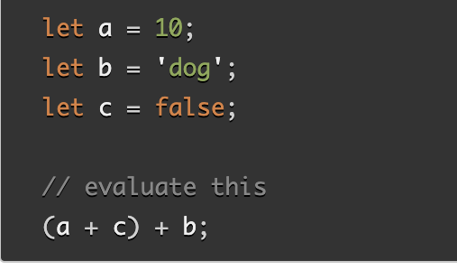

# HTML Lists, Control Flow with JS, and the CSS Box Model

## Learn HTML: Ordered and Inordered lists

1. When should you use an unordered list in your HTML document?

- is for grouping a collection of items that do not have a numerical ordering, and their order is meaningless.

2. How do you change the bullet style of unordered list items?

- list-style

3. When should you use an ordered list vs an unorder list in your HTML document?

- when the list has to be in order or following an instruction.

4. Describe two ways you can change the numbers on list items provided by an ordered list?

- list-style-type and type

## Learn CSS: The Box Model

1. Describe the CSS properties of margin and padding as characters in a story. What is their role in a story titled: “The Box Model”?

- Margin and Padding are two characters with special properties. Margin creates whitespace to separate elements, while Padding adds space around the content. When Box arrives, Margin ensures it has enough breathing room, while Padding makes its content comfortable. Together, they help elements find their perfect positions, creating harmony and balance in design.

2. List and describe the four parts of an HTML elements box as referred to by the box model.

- Content Box: Area where content is displayed.
- Padding Box: Sits around the content as white space.
- Border Box: Wraps the content and any padding.
- MArgin Box: Outermost layer that wraps the content, padding, and border as a whitespace between this box and other elements.

## Learn JS: Arrays, Operators and Expressions. Conditionals. Loops

1. What data types can you store inside of an Array?

- strings, numbers, objects, and even other arrays.

2. Is the people array a valid JavaScript array? If so, how can I access the values stored? If not, why?
 **const people = [['pete', 32, 'librarian', null], ['Smith', 40, 'accountant', 'fishing:hiking:rock_climbing'], ['bill', null, 'artist', null]];**

 - 

3. List five shorthand operators for assignment in javascript and describe what they do.

- += Addition
- -= Subtraction
- *= Multiplication
- /= Division

4. Read the code below and evaluate the last expression and explain what the result would be and why.

- 10dog is the result

5. Describe a real world example of when a conditional statement should be used in a JavaScript program.

- without a proper PPE, a person can get hurt.

6. Give an example of when a Loop is useful in JavaScript.

- repetitive task, multiple calculations.

## Things I want to know more about

- need more explanations for this question: 2. Is the people array a valid JavaScript array? If so, how can I access the values stored? If not, why?
