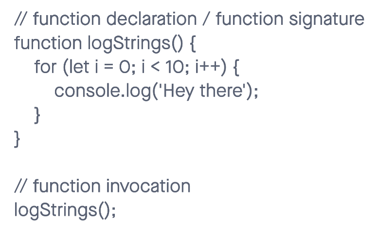

# Read 04: HTML Links, JS Functions, and Intro to CSS Layout

## Learn HTML

[Creating Hyperlinks](https://developer.mozilla.org/en-US/docs/Learn/HTML/Introduction_to_HTML/Creating_hyperlinks)

1. To create a basic link, we wrap text or other content inside what element?

- <a> and using href attribute.

2. The href attribute contains what information?

- web address

3. What are some ways we can ensure links on our pages are accessible to all readers?

- including keywords in the link to decribe the link
- adding features that makes the link stand out.

## CSS Layout

[Normal Flow CSS Layout:Positioning](https://developer.mozilla.org/en-US/docs/Learn/CSS/CSS_layout/Normal_Flow)

1. What is meant by “normal flow”?

- the way that webpage elements lay themselves out or the default layout of CSS elements.

2. What are a few differences between block-level and inline elements?

- block-level fills the available inline space of the parent element containing it, growing along the blokc dimention to accommodate its content.
- inline-level is just the size of their content. Aligned to each other vertically or horizontally, depending on the writing mode.

3. ___ positioning is the default for every html element.

- Static positioning. This also means the the element will stay at the normal position in the document flow.

4. Name a few advantages to using absolute positioning on an element.

- creating precise layouts.

5. What is a key difference between fixed positioning and absolute positioning?

- position origin. absolute positioning is relative to the containing block/ancestor/parent while fixed is relative to the initial block.

## Learn JS

[Functions-Reusable Blocks of Code](https://developer.mozilla.org/en-US/docs/Learn/JavaScript/Building_blocks/Functions)

1. Describe the difference between a function declaration and a function invocation.

- function invocation needs a variable assigned to be able to run while declaration is when you have a name declared to the function to be able to run.

2. What is the difference between a parameter and an argument?

- parameter is a variable in function. it's a placeholder and argument is basically the answer to the parameter. 
ex. (a,b) is the parameter and after finding out what the a and b is through a process, the answer will be what we call the argument ex. (3,4)

## Misc

[6 Reasons for Pair Programming](https://www.codefellows.org/blog/6-reasons-for-pair-programming/)

1. Pick 2 benefits to pair programming and reflect on how these benefits could help you on your coding journey.

- Great efficiency: by listening the the pair and coming up with ideas, this will reduce the amount of time spent and wasted in an area where a person can get stuck on.
- Learning from fellow students: this will also be a great opportunity to share ideas and learn more as the pair tackles obstacles in their codes.

## Things I want to know more about

- As I previously mentioned in my prior class reading notes, there's so much to learn and feeling like as soon as I learn something, i'll find out that there's more to the topic the next day. As of right now, I just want to focus on learning the current topic and study more after to prevent myself from being side tracked or lose focus.

[Home](https://sfpagalan.github.io/reading-notes/)