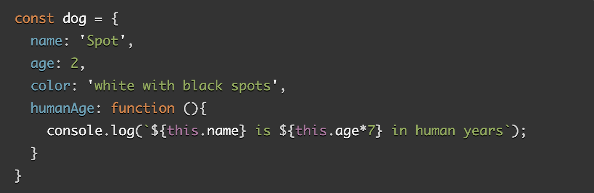

# Read 06: Problem Domain, Objects, and the DOM

## JavaScript Object Basics
[Source](https://developer.mozilla.org/en-US/docs/Learn/JavaScript/Objects/Basics)

1. How would you describe an object to a non-technical friend you grew up with?

- An object is like a way to organize and group related data and functionality together. It is similar to how a box holds various items and each items has its own characteristics and functions.

2. What are some advantages to creating object literals?

- when only need to create one object.

3. How do objects differ from arrays?

- arrays are used to store ordered collections of values while objects are used to store collections of related data with named properties.

4. Give an example for when you would need to use bracket notation to access an object’s property instead of dot notation.

- when dealingwith property names that have special characters or spaces.

5. Evaluate the code below. What does the term this refer to and what is the advantage to using this?

- *this* refers to the current object *dog*. It allows access and refer to the properties and methods of the current object dynamically and become more reusable and flexible.

## Introduction to the DOM
[source](https://developer.mozilla.org/en-US/docs/Web/API/Document_Object_Model/Introduction)

1. What is the DOM?

- *Document Object Model* is the data representation of the objects that comprise the structure and content of a document on the web.
- Is a programming interface for web documents.

2. Briefly describe the relationship between the DOM and JavaScript.

- The DOM is not a programming language, but without it, the JavaScript language wouldn't have any model or notion of web pages, HTML documents, SVG documents, and their component parts.

## Things I want to know more about.

- I would like to learn more about DOM and the different uses of this.