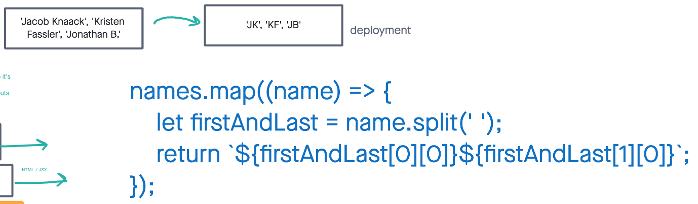
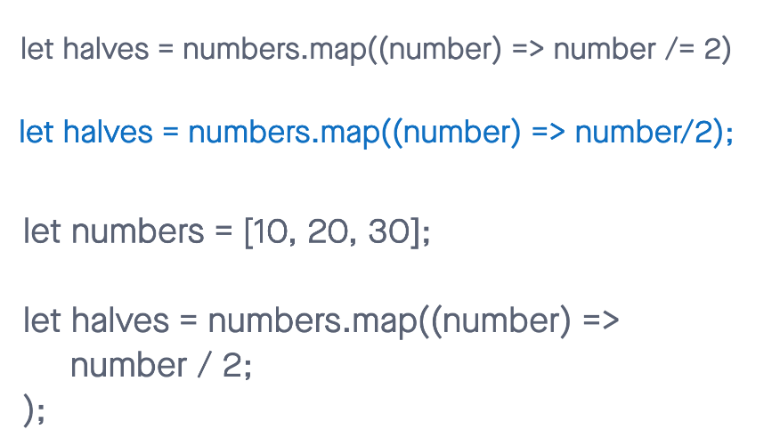

# Read 02: State and Props

## React lifecycle

[Source](https://medium.com/@joshuablankenshipnola/react-component-lifecycle-events-cb77e670a093)

1. Based off the diagram, what happens first, the ‘render’ or the ‘componentDidMount’?

- The render method is called after the constructor and componentDidMount is called after the render method and is used for performing side effects.

2. What is the very first thing to happen in the lifecycle of React?

- The very first thing to happen in the lifecycle of React is the constructor method being called when a component is being created.

3. Put the following things in the order that they happen: componentDidMount, render, constructor, componentWillUnmount, React Updates

- constructor, render, componentDidMount, React Updates, and componentWillUnmount.

4. What does componentDidMount do?

- fetch data from an API, setting up subscriptions, or initializing third-party libraries. perform side effects that are necessary when a component is fully mounted and visible to the user.

## React State Vs Props

[Source](https://www.youtube.com/watch?v=IYvD9oBCuJI)

1. What types of things can you pass in the props?

- strings, numbers, booleans, arrays, objects, functions, and even components.

2. What is the big difference between props and state?

- props are passed into a component from the outside, while state is handled and managed internally within the component.

3. When do we re-render our application?

- when there is a change in state.

4. What are some examples of things that we could store in state?

- user input, form values, toggle/checkbox states, API responses.

## Things I like to know more about

understanding the difference between props and state in React.

### Notes

1. How to grab the first letter of the first name and last name to grab the initials.

let initials = name.map((name) => {
    let firstAndLast = name.split('');
    return `${firstAndLast[0][0]}${firstAndLast[1][0]}`;
});

2. Half a number arrays. Image is one of the examples the class gave.

let numbers = [10, 20, 30];

let half = numbers.map((number) => {
    return number / 2;
});

console.log(half); // Output: [5, 10, 15]

[Home](https://sfpagalan.github.io/reading-notes/)
