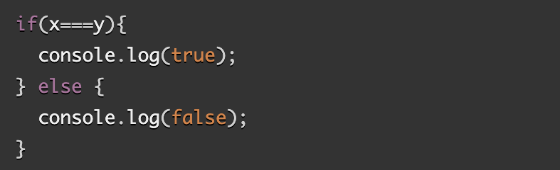

# Read 04: React and Forms

## React Docs - Forms

[Source](https://legacy.reactjs.org/docs/forms.html)

1. What is a ‘Controlled Component’?

- refers to a form element, like an input or textarea, whose value is controlled by the component's state.

2. Should we wait to store the users responses from the form into state when they submit the form OR should we update the state with their responses as soon as they enter them? Why.

- recommended to update the state with the user's responses as soon as they enter them, rather than waiting until they submit the form. Because, updating the state as the user types provides a more responsive and interactive user experience.

3. How do we target what the user is entering if we have an event handler on an input field?

- To target what the user is entering when you have an event handler on an input field, you can use the event object passed to the event handler function.

## The Conditional (Ternary) Operator Explained

[Source](https://codeburst.io/javascript-the-conditional-ternary-operator-explained-cac7218beeff)

1. Why would we use a ternary operator?

- often used when you have a simple if-else structure. 

2. Rewrite the following statement using a ternary statement:

- console.log(x === y ? true : false);

## Things I want to know more about

Exploring the ternary operator and its applications.

## CLASS NOTES 8/17/23

.forEach() - for loop with a callback,
.map() - for loop with a callback, that also returns a totally array
.filter() - use a callback to remove items -> return true to keep / return false to remove.
.sort(a,b) - use a comparator callback.

### Sorting

- .sort(a,b) - use a comparator callback.
    the callback should return:
        numbers less than 0 (a comes before b)
        0 (they are equal - no movement necessary)
        numbers greater than 0. (b comes before a)

For example:
    4, 10, 3, 50, 26, 42 -> sort this number to this -> 50, 42, 26, 10, 4, 3
    let numbers = [4, 10, 3, 50, 26, 42];
    numbers.sort((a, b) => {
        if (a, b) {
            return 1;
        } else if (a > b) {
            return -1;
        } else {
            return 0
        }
    });

[Home](README.md)
