# Introduction to SQL

## Relational Database 

- data is structured and organized into tables, each resembling a spreadsheet with rows and columns.
- Rows represent individual data entries, and each row is uniquely identified by a primary key.
- Columns define the types of data stored in the table, with specific data types and constraints. Foreign keys establish relationships between tables, allowing data to be linked efficiently.

## SQL, or Structured Query Language

- is a specialized language for interacting with relational databases.
- SQL includes commands for querying data (SELECT), adding data (INSERT), modifying data (UPDATE), and deleting data (DELETE).
- SQL supports data definition commands (CREATE, ALTER, DROP) and constraints (e.g., UNIQUE, NOT NULL) to ensure data consistency.
- It also provides tools for sorting and grouping data (ORDER BY, GROUP BY) and joining data from multiple tables.
- SQL can be used within transactions (BEGIN, COMMIT, ROLLBACK) to ensure data changes are handled reliably.

Overall, SQL is a powerful tool for managing and querying data in relational databases, making it crucial for various software applications and data-centric industries.

## SQL Bolt Screenshots

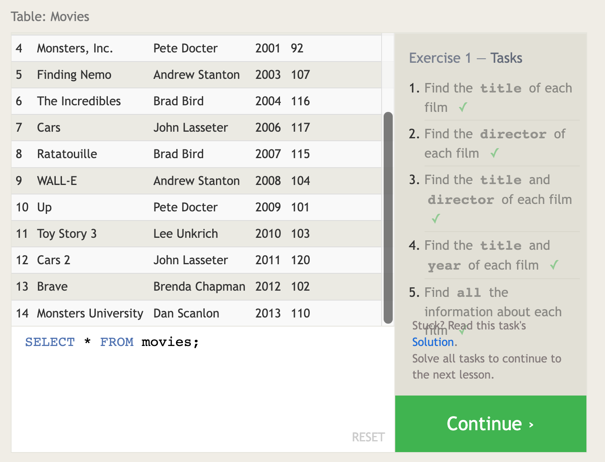
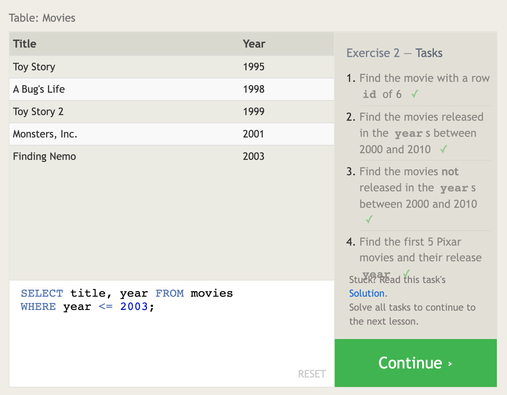
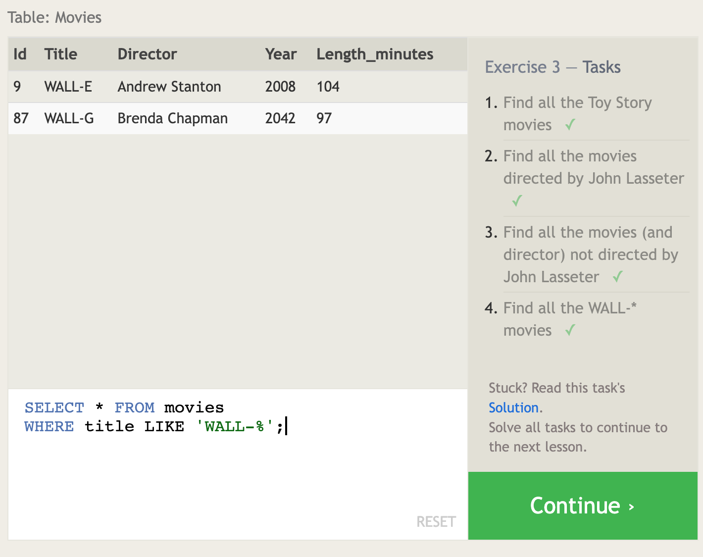
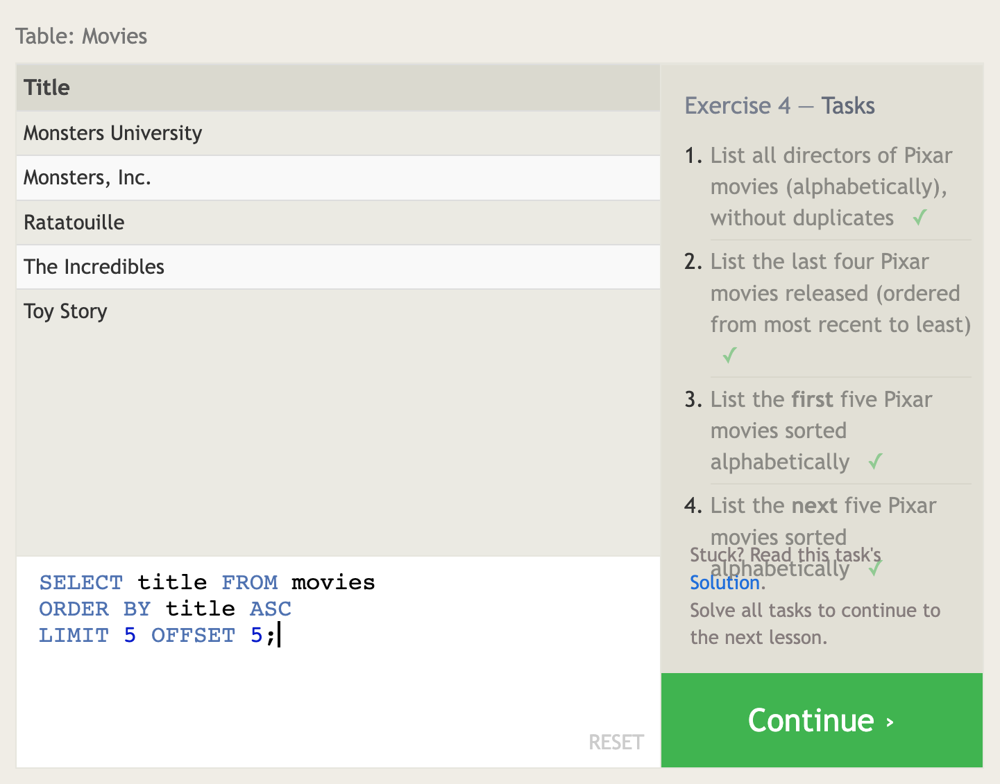
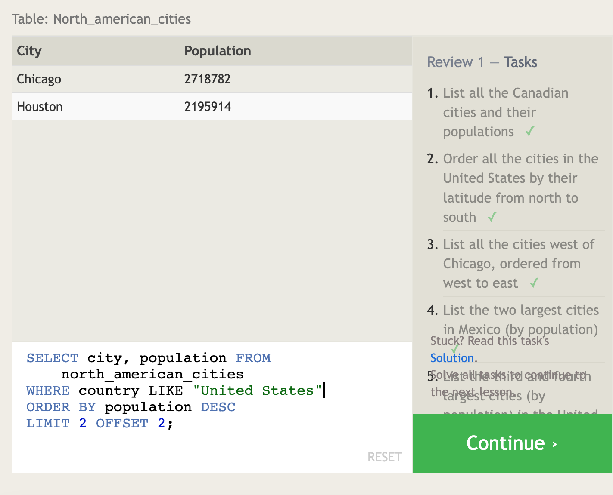
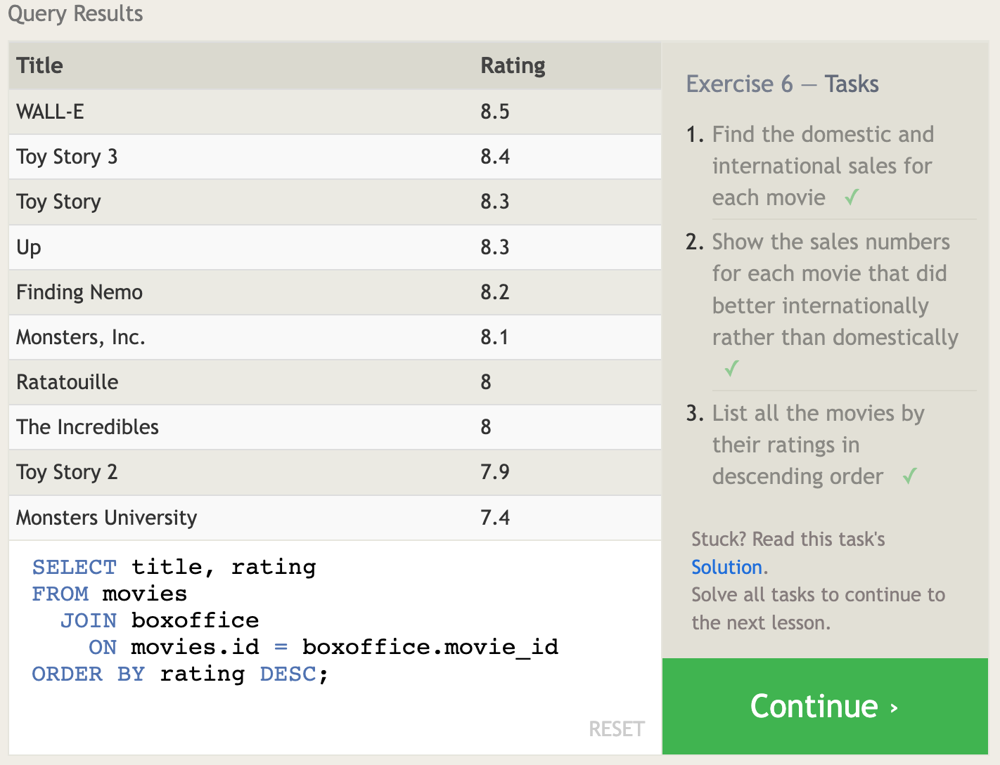
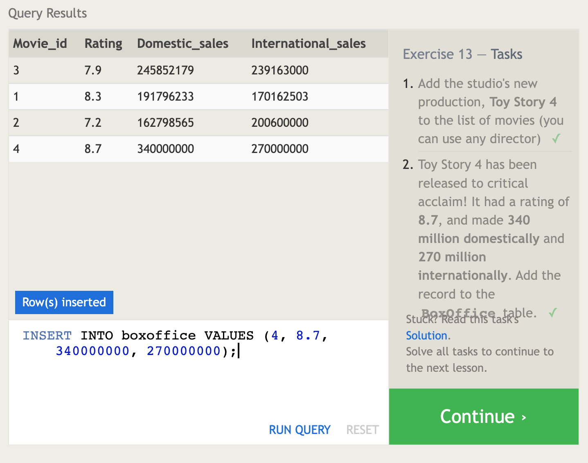
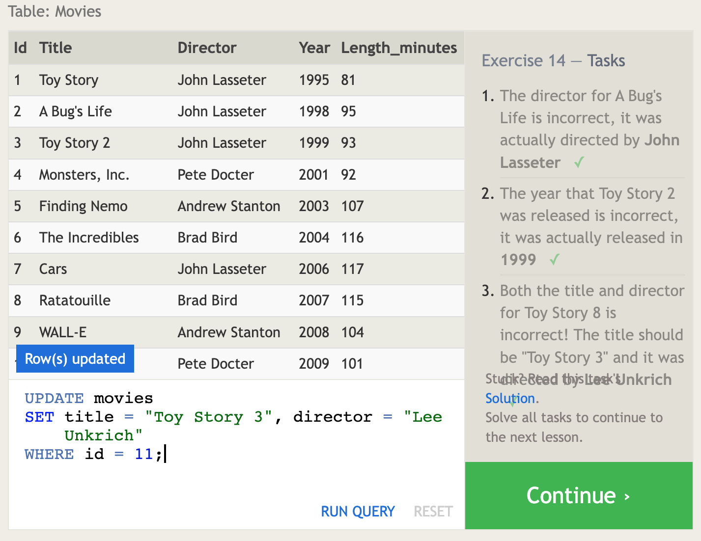
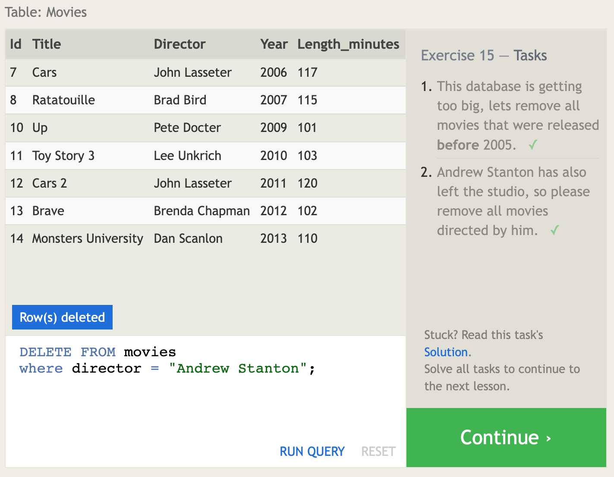
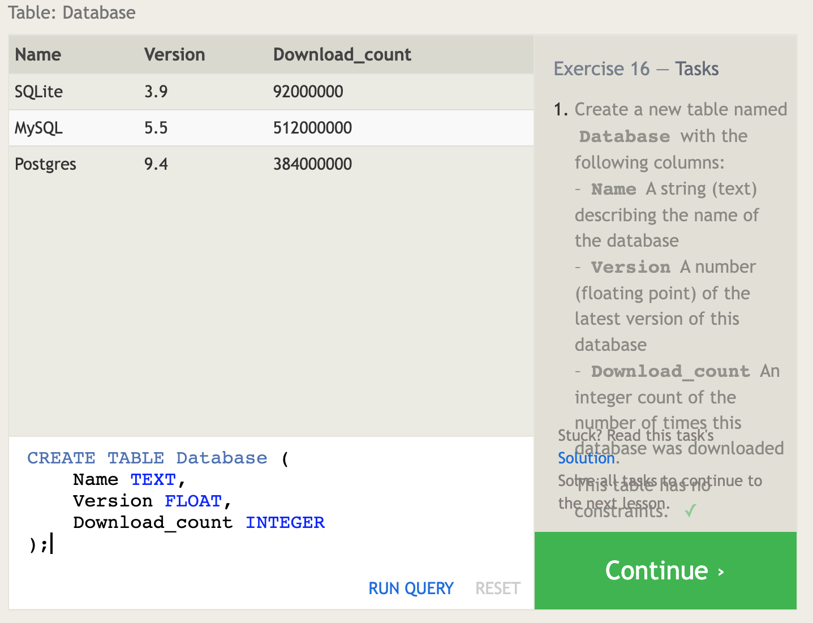
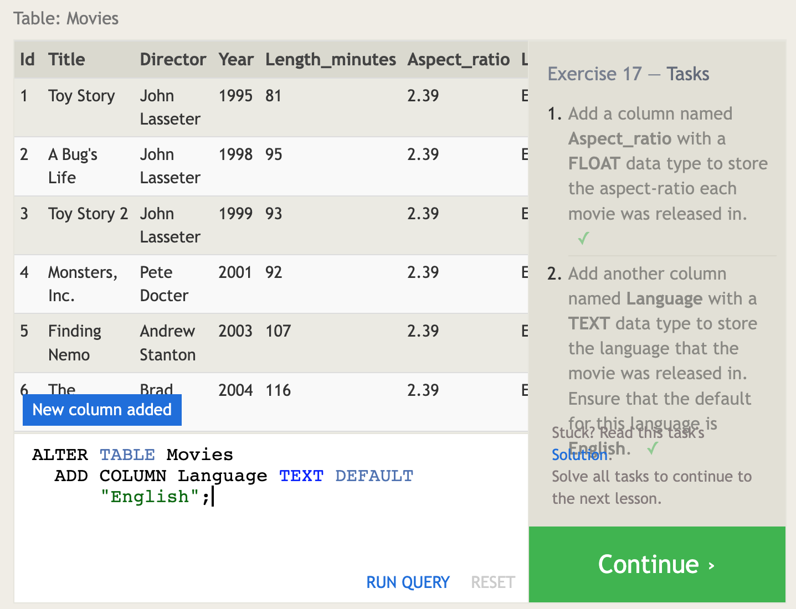
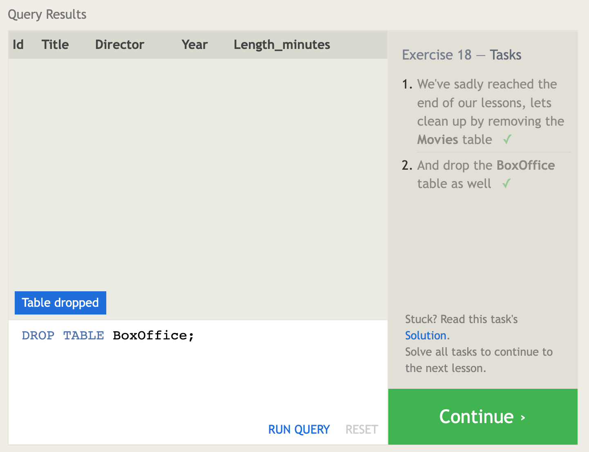

[Home](https://sfpagalan.github.io/reading-notes/)