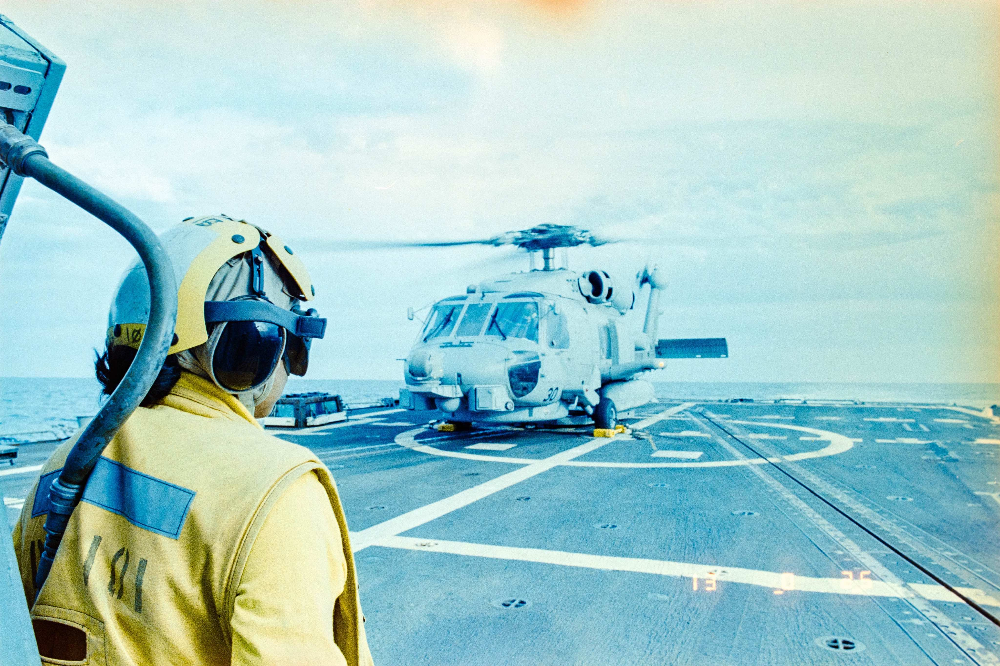

# reading-notes
Reading Notes Repository

## Growth Mindset 

Growth Mindset is knowing that with hardwork and perseverance, you'll eventually get through the hard part of the problem. Having that type of mindset will enable yourself to keep on improving and stay motivated despite the challenges you'll encounter. 

### Some reminders to stay motivated

1. <blockquote> Knowledge is when you learn something new every day. </blockquote> - Ralph Waldo Emerson

This quote is what motivates me from the time I've read/heard about it. Regardless of background or how high the lever of education a person had, that shouldn't keep us from keeping an open mind and try to learn new things.

2. <blockquote> Hard work beats talent when talent doesn't work hard. </blockquote> - Tim Notke.

Everyone is probably aware of this story about The Hare and The Tortoise. This story teaches us that hardwork will always guarantee self-satisfaction and may even bare fruit of success. Others may have the talent to do the things you're just learning but that shouldn't stop you from doing what you need to do to reach that spot.

3. <blockquote> It's not how far you fall, but how high you bounce that counts.</blockquote> - Zig Zaglar

Walt Disney is probably one of the most famous story about failure. I always like to remind myself that back in the day nobody would want to hire Walt Disney as an artist and look at us now. The world is ever changing and Disney is one of the inspirational figure I like to read about.

#### ABOUT ME

My name is Sydney, my pronouns are She/Her. As much as I love all the cool and fun stuff I did while I was in the US Navy, I sadly had to leave and pursue one of my dream career which is working in the Healthcare field. My career in the healthcare field is amazing as I enjoy helping patients and just gaining medical knowledge daily. I decided to leave and enroll at Code Fellows to learn something else that I'm passionate about, which is computer and technology. The tech industry is evolving as a fast pace and I wanted to become a part of it.
